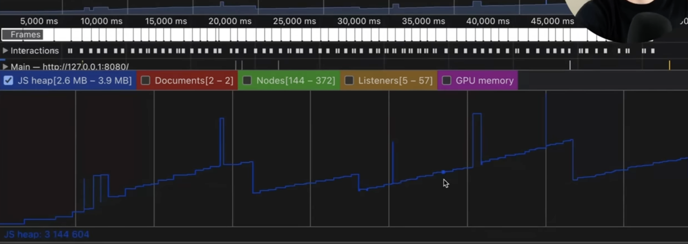
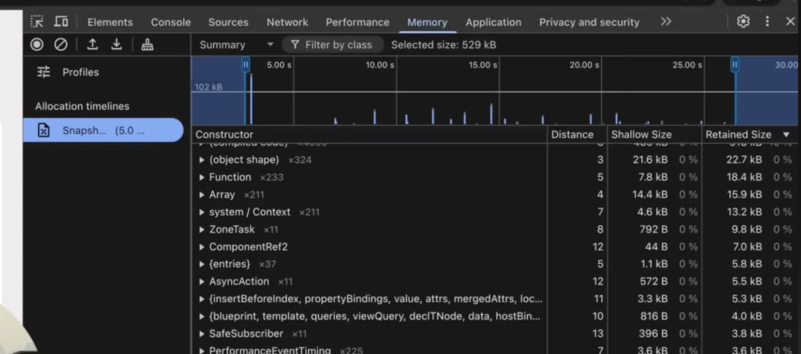
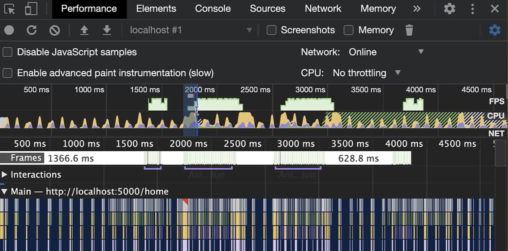
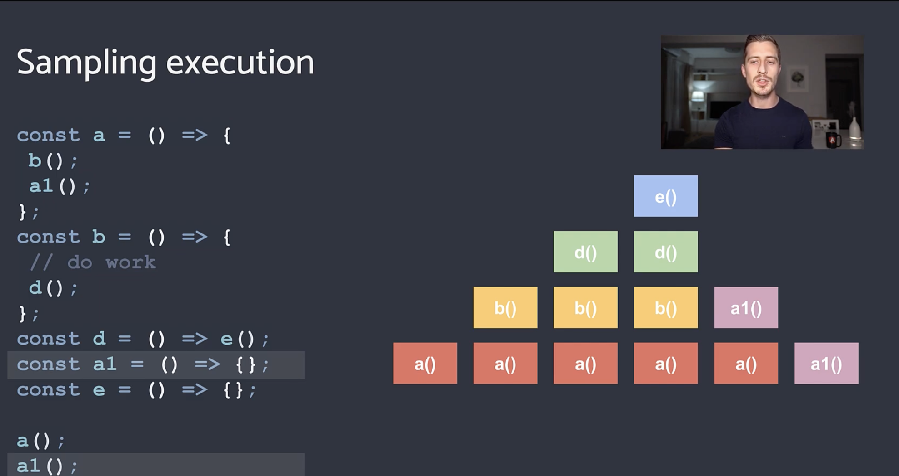
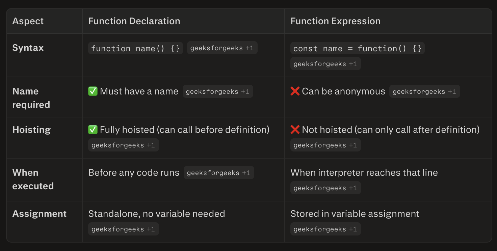
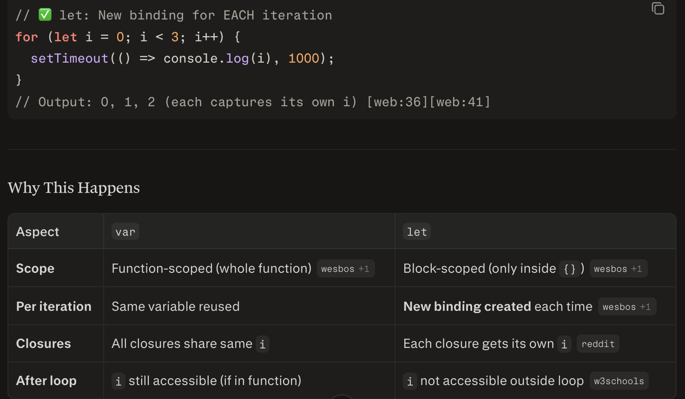

- Angular Validators
  Reactive form and templated driven forms
  validate user input before submit
  Validator Rule always returns valid/invalid or null
  Built-in Validators - Validators.required, Validators.email, Validators.minLength(5)

   - Custom Validator
        username cannot be admin
                import {AbstractControl,ValidationErrors,ValidatorFn} from '@angular/forms';
                export function usernameValidator(): ValidatorFn {
                        return (
                            control: AbstractControl  **IMPORTANT**
                        ): ValidationErrors | null => {

                            if (
                            control.value?.toLowerCase() === 'admin'
                            ) {
                            return {
                                invalidUsername: true
                            };
                            }

                            return null;
                        };
                }

                this.form = new FormGroup({
                    username: new FormControl(
                        '',
                        [
                        Validators.required,
                        usernameValidator()
                        ]
                    )
                    });
   - Cross Field Validator
                    password = confirmPassword
            export function passwordMatchValidator(
                group: AbstractControl
                ) {

                const password =
                    group.get('password')
                    ?.value;

                const confirm =
                    group.get('confirmPassword')
                    ?.value;

                return password === confirm
                    ? null
                    : { passwordMismatch: true };
            
            this.form = new FormGroup(
                    {
                    password:
                        new FormControl(''),

                    confirmPassword:
                        new FormControl('')
                    },
                    {
                    validators:
                        passwordMatchValidator
                    }
                    );
   - Async Validator
        API only called when user leaves field.
    
        checkUsername(
            username: string
            ){

            return this.http.get<boolean>(
            `/api/users/check/${username}`
            );
            }
        
        this.form = new FormGroup({

        username: new FormControl(
            '',
            {
            asyncValidators: [
                usernameExistsValidator(
                this.userService
                )
            ],
            updateOn: 'blur'
            }
        )

        });

            Why updateOn:'blur' ?   ---> 'submit' // 'blur' | 'change'

                Without it:

                u
                ut
                utk
                utka
                utkar
            
            form = new FormGroup({
                    letter: new FormControl('', {
                        validators: [Validators.required, Validators.minLength(1), Validators.maxLength(1)],
                        asyncValidators: [this.letterValidator()],
                        updateOn: 'submit' // 'blur' | 'change'
                    })
                    });

    setValue()  Must provide ALL fields
    patchValue() Partial update.

- Why use trackBy?

    If trackBy is missing, Angular may destroy and recreate all list items on array changes, 
    losing UI state and hurting performance, even if the data (IDs) hasn’t meaningfully changed.
    On first render:
    Stores the reference of each object in the array as its identity.
    When the array changes (new array, even with same IDs):
    Angular compares old references vs new references.
    If the references are different (even if routerId is the same), Angular assumes:
        All old items are gone.
        All new items are new.
    Case 1: Mutate same array with push
        Angular can detect that the array length changed, but it still doesn't know stable IDs for each item.

    trackBy tells Angular: 
        "This item is the same as before because its ID is the same," regardless of whether 
        the array reference changed or you mutated in place.
        It only answers: "Is this item the same as before based on its ID?"

- Why use OnPush?

    By default, Angular checks every component in the entire app on every change detection cycle 
        (click, timer, HTTP, etc.). This can be slow in large apps.
        Performance: Skip checking huge parts of the tree when they haven't changed.
        Predictability: You control exactly when a component updates by managing references.

    Works well with:
        Immutable data (replace instead of mutate).
        Signals (automatic, no manual work needed).
        RxJS + async pipe.
    When does OnPush check for changes?
        An @Input() reference changes
        An event happens in this component or its children
        You use the async pipe
        You manually mark it

- When to Choose Signal vs BehaviorSubject
    Signal = synchronous, pull-based state for UI.

    BehaviorSubject = asynchronous, push-based stream for events and complex async flows.

    Why Signal
      Simple, no subscription boilerplate 
      Automatically updates when dependencies change 
      Fine-grained updates, fewer CD cycles 
      Signals don't rely on Zone.js **IMPORTANT**

        // Component state
        readonly count = signal(0);
        readonly doubled = computed(() => this.count() * 2);

        // Update
        this.count.update(c => c + 1);

    Why BehaviorSubject
      Built for push-based async flows (WebSocket, HTTP, timers)
      RxJS operators are powerful 
      Single source of truth via subscription 

        // Async data stream
        private usersSubject = new BehaviorSubject<User[]>([]);
        users$ = this.usersSubject.asObservable();

        // Load from API
        loadUsers() {
        this.http.get<User[]>('/api/users').subscribe(users => {
            this.usersSubject.next(users);
        });
        }
       HTTP returns Observable (RxJS), not a signal directly.

- Promise vs Observable
  Promise
    One value only (then resolves once) 
    Eager (starts immediately when created) 
    Not cancellable
  Observable
    Multiple values over time (next() can emit many times) 
    Lazy (doesn't start until you subscribe) **IMPORTANT**
    Cancellable (unsubscribe()) 
  
    Angular's HttpClient returns Observables, not Promises:
    * You can convert an Observable to a Promise if you only need the last emitted value:
        const users = await firstValueFrom(
            this.http.get<User[]>('/api/users')
        );

        OR 

        const users = await this.http.get<User[]>('/api/users').toPromise();
    * You can turn a Promise into an Observable using from():

- Why Not Store Everything in Signals?
    Unnecessary overhead
    If a variable never changes, there's zero benefit in making it a signal. You just add:
    Memory overhead (each signal object).
    Tracked dependency overhead (Angular tracks every signal read).

    Slight runtime cost for signal call syntax (signal() vs plain variable).
        Too many signals can slow change detection:
        - Angular tracks every signal read in templates and computed signals.
        - Hundreds/thousands of signals = more tracking overhead.
        - Better to group related state into one signal holding an object/array.

- ViewChild vs ElementRef vs Renderer2
  These three are not alternatives—they work together in Angular. Each has a different purpose:
  1. ViewChild — Query for child components/elements
     Use when: You need to access a specific child in your template.
     @ViewChild('myButton') buttonRef!: ElementRef<HTMLButtonElement>;
     @ViewChild(MyChildComponent) childComp!: MyChildComponent;
  2. ElementRef — Wrapper around native DOM element
     Use when: You only need to read element info (e.g., getBoundingClientRect), not modify DOM.
     What it is: A class that wraps a native DOM element.
     What it gives: elementRef.nativeElement → direct access to DOM element.
     What it lets you do: Read/modify DOM properties directly.
    Problem: Direct DOM manipulation is unsafe (XSS, SSR, Web Workers broken).
  3. Renderer2 — Safe DOM manipulation abstraction
     What it is: A service that provides safe DOM manipulation.
     What it does: Methods like setAttribute, setStyle, appendChild, etc.
     Why safer: Works in SSR, Web Workers, and prevents XSS.
     Works with: ElementRef → you pass ElementRef.nativeElement to Renderer2 methods.

- MutationObserver — Simple Core Understanding
    MutationObserver is a built-in JavaScript API that watches for changes to the 
    DOM and triggers a callback when changes happen.

    Observes DOM changes efficiently in batches (not per individual change)
    const observer = new MutationObserver(callback);  // CALLBACK Important here
    const targetNode = document.getElementById('myElement');

    const config = {
    childList: true,    // Observe direct children added/removed
    subtree: true,      // Observe all descendants
    attributes: true,   // Observe attribute changes
    characterData: true // Observe text content changes
    };

    observer.observe(targetNode, config);
    observer.disconnect();

- Zone.js — What It Does (Simple Core Understanding)
    JavaScript is single-threaded and doesn't natively tell you when async operations complete. Without Zone.js, 
    Angular would have no way to know when to run change detection after things like:
    setTimeout / setInterval
    Promises / async/await
    HTTP requests
    User events (click, keyup, etc.)
    WebSockets

    Zone.js intercepts (monkey-patches) all these async APIs so Angular can be notified when they complete
    - How it works in Angular
        Angular creates a special zone called NgZone when the app starts.
        All your code runs inside this zone.
        When an async event completes (e.g., HTTP response, button click):
        Zone.js detects it.
        Angular runs change detection from root to the affected components.
        The UI updates automatically
    
    Zoneless Angular (future)
        With signals and explicit change detection, Angular is moving toward zoneless mode:
        No monkey-patching.
        Developers manually trigger change detection or use signal() + computed().
        Better performance, but more manual work

- Deep Copy

    function deepCopy(obj) {
    if (obj === null || typeof obj !== 'object') return obj;
    
    if (Array.isArray(obj)) {
        return obj.map(deepCopy);
    }
    
    const copy = {};
    for (let key in obj) {
        if (obj.hasOwnProperty(key)) {
        copy[key] = deepCopy(obj[key]);
        }
    }
    return copy;
    }

    const b = deepCopy(a);

- How would you render 100k nodes?
    * Virtual Scroll
        <cdk-virtual-scroll-viewport
            itemSize="50">
            

                {{router.name}}
            

        </cdk-virtual-scroll-viewport>
        *ngFor renders all items in the DOM, which is fine for small datasets. CDK Virtual Scroll is used for 
        large datasets because it only renders visible items, significantly reducing DOM size and improving 
        scrolling performance.
        CDK Virtual Scroll significantly reduces DOM rendering cost, but it works best with fixed-height items.
        Dynamic row heights, complex tables, accessibility concerns, and stateful row components can 
        make it more challenging. Also, virtual scrolling only solves rendering performance; 
        data processing and update efficiency still need separate optimization
    trackBy
    Pagination **IMPORTANT**
    OnPush
    lazy load
    batch updates

- How would you handle 500 websocket updates/sec?
    1. bufferTime
    2. batching
        I would batch WebSocket events using bufferTime(500), then deduplicate updates by routerId using a Map, 
        and finally update the UI once per batch instead of once per event.
     socket$
        .pipe(
        bufferTime(500)
        )
        .subscribe(batch => {

        const latest = new Map();

        batch.forEach(update => {
            latest.set(update.id, update);
        });

        console.log([...latest.values()]);
        });
    3. Map lookup
    4. virtual scroll

- State Management
   1. Why not store state in component?  Tight coupling, No sharing, Hard to debug, No traceability
      When to use component state (local state) -  Short-lived, Screen-local, No sharing needed
   2. NgRx vs Signal Store vs BehaviorSubject
      BehaviorSubject (RxJS)
        Small to medium apps, Simple state sharing, Need async operators (map, filter, debounceTime)
        @Injectable({ providedIn: 'root' })
        export class UserService {
        private userSubject = new BehaviorSubject<User | null>(null);
        user$ = this.userSubject.asObservable();
        setUser(user: User) {
            this.userSubject.next(user);
        }
        }
      NgRx (Redux pattern) **IMPORTANT**
        Large, complex apps, Multiple teams working together, Need time-travel debugging, Centralized store (single source of truth)
        // action
        export const loadUser = createAction('[User] Load');

        // reducer
        const userReducer = createReducer(initialState, on(loadUser, (state) => ({ ...state, user: fetchedUser })));

        // component
        dispatch(loadUser());
        user$ = store.select(selectUser);

- Microfrontend Architecture
    WHY
    ↓
    SPLIT
    ↓
    SHELL
    ↓
    REMOTES
    ↓
    ROUTING
    ↓
    AUTH
    ↓
    COMMUNICATION
    ↓
    SHARED LIBS
    ↓
    DEPLOYMENT
    ↓
    CHALLENGES
    
    have integration document and solution template **IMPORTANT**
    webpack config ModuleFederationPlugin 
    react use webpack build-> webpack serve, reactDom.createroot(container) root.render</app > 
       return { unmount()=> {root.unmount()}}

- How Angular Shell talks to React Remote?
   Props + Events (Custom Events)
   Global Event Bus
   URL/query parameters
   Lifecycle Sync

- routing inside mfe

    In an Angular Module Federation setup, the shell owns the top-level route segment such as /customer or /payment. Once the shell loads the remote module, Angular routing inside that remote handles the remaining path segments. For example, for /customer/details/123, the shell matches /customer, loads the Customer MFE, and then the Customer router resolves details/123. This allows each micro frontend to manage its own nested routing independently while the shell remains responsible for application-level navigation.

    Problem occurs when teams use:navigationService.navigate() without updating url

    Browser back and forward navigation continue to work normally in a Module Federation architecture because navigation is URL-driven. The browser simply restores the previous URL. The shell router determines which micro frontend owns that route, loads the corresponding remote if necessary, and then the remote router resolves the remaining path segments. As long as routing state is reflected in the URL rather than internal application state, browser navigation behaves correctly across micro frontends.

- singleton: true only ensures one library instance, not one service instance
- requiredVersion
- Best practice: Use async pipe whenever possible to avoid manual markForCheck()

- Common Causes of Memory Leaks in Angular
  1. Unsubscribed Observables (Most Common) - Subscriptions keep components alive even after they're destroyed
     Fix 
     Option A: Use AsyncPipe (Best)
     Option B: Use takeUntilDestroyed() (Angular 16+)
     Option C: Manual unsubscribe() in ngOnDestroy()
     Option D: Use takeUntil() Operator
  2. Event Listeners Not Removed **IMPORTANT**
     Fix 
     // ✅ Clean up
     constructor(private renderer: Renderer2) {}

     ngOnInit() {
        this.cleanup = this.renderer.listen('window', 'resize', this.onResize);
     }

     ngOnDestroy() {
        this.cleanup();  // Remove listener
      }
    OR window.removeEventListener('resize', this.onResize);
  3. Subjects/BehaviorSubjects Not Completed **IMPORTANT**
     // ❌ Memory leak in service
        @Injectable({ providedIn: 'root' })
        export class DataService {
        private dataSubject = new BehaviorSubject<any>(null);
        data$ = this.dataSubject.asObservable();
        // Never completed → stays in memory
        }
     // ✅ Complete when done
        ngOnDestroy() {
        this.dataSubject.complete();
        }
   4. Missing trackBy in ngFor  **IMPORTANT**
   5. Long-Lived Services Holding Component References **IMPORTANT**
      
- Why Return Observable Instead of .subscribe() in Services?
    Let the component decide when to subscribe.
    // ✅ GOOD - Return Observable
    @Injectable({ providedIn: 'root' })
    export class DataService {
    private dataSubject = new BehaviorSubject<any>(null);
    
    // Expose as Observable
    data$ = this.dataSubject.asObservable();
    
    // Or return Observable directly
    getData(): Observable<User[]> {
        return this.http.get<User[]>('/api/users');
    }
    }

    OPTION A Subscription
        @Component({})
        export class MyComponent implements OnInit, OnDestroy {
        data: User[] = [];
        private subscription: Subscription;
        
        ngOnInit() {
            this.subscription = this.dataService.getData()
            .subscribe(data => this.data = data);
        }
        
        ngOnDestroy() {
            this.subscription.unsubscribe();  // Clean up
        }
        }
    OPTION B async pipe
       export class MyComponent {
       data$ = this.dataService.getData();  // No subscription needed
       }
    OPTION C takeUntilDestroyed or takeUntil (it need this.destroy$)

- Memory Leak Debugging — Complete Guide
  1. Confirm There's a Memory Leak
     Before debugging, verify memory is actually leaking
  2. JavaScript/Angular Debugging (Chrome DevTools)
        Technique 1: Heap Snapshots
            Open Chrome DevTools → Memory tab **IMPORTANT**
            Take Heap Snapshot → Click "Take snapshot"
            Interact with app (navigate, click, etc.)
            Take another snapshot
            Compare snapshots → Look for:
            Detached DOM nodes (elements no longer in DOM but still in memory)
            Destroyed components still in memory
            Growing arrays/objects that never shrink

        Technique 2: Allocation Timeline
            Memory tab → Select Allocation instrumentation on timeline
            Click Start recording
            Interact with app (navigate, click, scroll)
            Click Stop recording
            Analyze → Look for memory spikes that never drop back down
        Technique 3: Performance Monitor **IMPORTANT**
            Performance Monitor tab (Chrome DevTools)
            Watch JavaScript heap size over time
            Memory should increase and decrease (GC runs)
            If it only increases → memory leak

- What is Micro Frontend Architecture
    Micro frontends extend microservices principles to the frontend. Instead of one monolithic SPA, we break it into smaller, independent applications that work together as one cohesive user experience.
    Technical benefits: 
    Independent deployment, Technology agnostic, Faster development, Scalability
    MFE Challenges (Be Honest About Trade-offs):
    Increased complexity, Shared dependencies, Performance overhead, Cross-team coordination, Debugging harder

    --> ANSWER WHAT WHY HOW 
    --> Acknowledge trade-offs
    --> Give a concrete example

- Debugging code 
    * Gather Information & Reproduce the Issue in lower environment
    * Debug JavaScript in Production (Frontend)
        Chrome DevTools - Pretty Print Feature: **IMPORTANT**
        Open browser → F12 or Ctrl+Shift+I
        Go to Sources tab
        Find minified file (e.g., main.js)
        Click {} (Pretty Print) button to format code
        Set breakpoint on line number
        Refresh page (don't press F5, or breakpoints reset)
        Debug normally (inspect variables, call stack)
    * Use Monitoring & APM Tools **IMPORTANT**
        What to look for:
        Error patterns (is it happening repeatedly?)
        Timeline (when did it start?)
        Scope (which users/features affected?)
        Breadcrumbs (sequence of events before crash

- Explain your approach to writing testable React/TypeScript components.
    Single responsibility, props-driven not side-effect-driven
    React Testing Library: test behaviour not implementation
    Custom hooks extracted and unit-tested separately
    Playwright for E2E user journeys

- What's your approach to code reviews?
    I established ESLint + Husky pre-commit hooks so trivial issues never reach review. 
    In reviews I focus on: correctness, testability, security (e.g. input validation, auth checks), 
    and knowledge sharing — every comment is a teaching moment for juniors.

- How do you approach frontend performance monitoring in production? Real User Monitoring (RUM) 
  I approach frontend performance monitoring in production using Real User Monitoring (RUM) to 
  capture actual user experiences
  Key metrics I track:
    Core Web Vitals (LCP, FID/INP, CLS) with alert thresholds (LCP > 4s for 10%+ users triggers alert)
    JavaScript errors and error rates
    API response times (strongly impacts frontend)
    Bundle sizes and resource loading durations
    Tools I use:
    Sentry for error tracking and performance monitoring
    Grafana Faro or New Relic for RUM (lightweight, integrates with backend APM)
    Lighthouse for audits
    Session replay for debugging
  Best practices:
    Tag metrics with user context (device, network, browser) for troubleshooting
    Set up dashboards + alerts for critical thresholds
    Track p95/p99 percentiles, not just averages
    Integrate frontend monitoring with backend APM (distributed tracing)
    Respect user privacy (GDPR, collect only needed data)
  Monitoring strategy:
    Monitor Core Web Vitals daily
    Alert on threshold breaches (LCP > 4s, error rate > 1%)
    Review session replays for errors

   Key Metrics to Monitor
  1. Core Web Vitals (Must-Have)
     LCP (Largest Contentful Paint)  Loading performance < 2.5s
     CLS (Cumulative Layout Shift)  < 0.1
  2. Additional Critical Metrics
     JavaScript errors, Rage clicks, Bundle size, Time to Interactive (TTI)
  3. API latency > 2s --- p95 percentile

- Update items in Signal
    update(router:Router){
        if(this.routersMap.has(router.routerId)){
        const foundRouter = this.routersMap.get(router.routerId);
        foundRouter?.update((current)=>({...current,
                                        ...router}));
        }
    }

- Performance checklist
    Build Analysis: ng build --configuration production --stats-json + webpack-bundle-analyzer
    Runtime: Chrome DevTools → Performance tab → Record interactions
    Memory: Chrome DevTools → Memory tab → Heap snapshots + GC
    Angular DevTools: Profiler → Component render times
    Core Web Vitals: LCP < 2.5s, FID < 100ms, CLS < 0.1
    Lighthouse: Get performance score + recommendations
    ✅ Use production builds
    ✅ Use ChangeDetectionStrategy.OnPush
    ✅ Use async pipe for Observables
    ✅ Add trackBy to *ngFor
    ✅ Lazy load all feature modules
    ✅ Use takeUntilDestroyed() for subscriptions
    ✅ Optimize images (< 500KB)
    ✅ Use OnPush change detection
    ✅ Replace Moment.js with Day.js
    ✅ Import libraries individually
    ✅ Set performance budgets , Flame graph , estimated and better long run call stack red and can navigate to the function
    ✅ Monitor Core Web Vitals
    ✅ Use Lighthouse for audits
    ✅ Check memory with DevTools
      Bundle size **IMPORTANT**
      Two option in chrome memory
       - Heapshot 
          Memory distribution + graph + GC drops	
          Finding detached DOM trees, comparing snapshots
          Show graph and drop in line show that it GC working fine
          
          
       - Allocation on timeline  
          will show timeline for each fucntion 
          also can compare multiple heapshot
          Timeline for each function + allocation by function	Finding memory leaks, seeing allocations over time
          

    ✅ Profile with performance tab
    
    
    
- RabbitMQ
    Traditional message broker ,   Fast delivery
    Push-based (consumer-configured prefetch) 
    Microservices, task queues, background jobs
    Deletes after delivery
- Kafka 
    Event streaming, high-throughput data processing, log aggregation
    Stores indefinitely, can replay

- check DSPDM
    # 1. Analyze old bundle
    ng build --configuration production --stats-json
    npx webpack-bundle-analyzer dist/old-app/stats.json

    # 2. Analyze new bundle
    ng build --configuration production --stats-json
    npx webpack-bundle-analyzer dist/new-app/stats.json

    # 3. Compare
    # Before: 2.8 MB
    # After: 450 KB
    # Improvement: 84% reduction

- profiling of angular app

Weekly trend analysis and optimization opportunitie
Design Router Monitoring Dashboard
Design Notification System
preventDefault
→ Stop browser action

stopPropagation
→ Stop parent handlers

stopImmediatePropagation
→ Stop everybody after me

- Testing Strategy (Jest, Cypress, Playwright)
        In our micro frontend architecture, the biggest production risk was not individual component failures but integration 
        failures between the shell and independently deployed remote entries. We used Playwright to validate that remote entries
        loaded correctly, shared authentication context properly, routing worked across modules, and end-to-end business
        workflows executed successfully. While Cypress could also perform UI automation, Playwright provided better 
        support for cross-browser execution, parallel testing, and system-level validation across multiple micro 
        frontends, making it a better fit for our architecture.
        I follow a layered testing approach where each tool serves a specific purpose rather than trying to solve 
        everything with a single framework.

        Jest - Unit Testing

        Jest is used for validating business logic, services, validators, utility functions, and reusable components. 
        Since Jest runs without a browser, tests execute very quickly and provide immediate feedback to developers.
        I prefer Jest for validating core business rules such as calculations, validations, transformations, and
        service logic because these tests are fast, stable, and easy to maintain.

        Cypress - UI Workflow and Regression Testing

        We primarily used Cypress for Angular UI workflow validation and regression testing. Cypress provides
        an excellent developer experience with powerful debugging capabilities, allowing developers to inspect
        every action, network request, and assertion during test execution. It was particularly useful for
        validating form behavior, user interactions, routing, validation messages, and common frontend workflows.

        Playwright - System and End-to-End Testing

        Later, we adopted Playwright for broader system-level testing because it offers better cross-browser support, 
        parallel execution, API testing capabilities, and stronger end-to-end coverage across multiple applications
        and micro frontends.

        Playwright was used to automate critical banking journeys such as:

        Authentication and login flows
        Role-based access control
        Approval workflows
        Maker-Checker processes
        API failure scenarios
        Cross-browser validation
        End-to-end business workflows

        For example, in a Maker-Checker approval process:

        Login as Maker → Verify Approve button is hidden.
        Login as Checker → Verify Approve button is visible and approval actions are allowed.

        These tests ensured that authorization and business rules were enforced correctly.

        Why Both Cypress and Playwright?

        Both Cypress and Playwright are capable E2E testing frameworks. Cypress was initially 
        adopted because of its strong developer experience and debugging capabilities. Playwright was later 
        introduced because it provided better cross-browser support, API testing, faster parallel execution, 
        and more comprehensive system testing features.

        For new greenfield projects, I would generally lean toward Playwright unless the organization 
        already has significant investment in Cypress.

        Performance and CI/CD

        One of Playwright's major advantages is its ability to execute multiple scenarios in parallel.
        We used parallel execution in CI/CD pipelines to significantly reduce regression testing time. 
        This enabled faster feedback cycles while maintaining confidence in critical banking workflows.

        Testing Philosophy

        I do not focus solely on coverage percentages. Instead, I prioritize tests based on business risk. 
        In banking applications, validating authorization, workflow transitions, approval processes, financial
        calculations, and failure scenarios is far more important than testing cosmetic UI behavior. The goal 
        is to ensure that critical business operations remain correct, secure, and reliable before every 
        production release.   

-  Event Propagation
    Method	          Stops Browser Action	           Stops Parent Bubbling	                  Stops Other Handlers on Same Element
    preventDefault()	      ✅	                             ❌	                                              ❌
    stopPropagation()	      ❌	                             ✅	                                              ❌
    stopImmediatePropagation()❌	                         ✅	                                           ✅     

    Does browser always bubble?

        No.

        Some events bubble:

        click
        mousedown
        mouseup
        keydown
        keyup
        input
        change

        Some do not:

        focus
        blur
        mouseenter
        mouseleave

        Interview question:   
        Yes, browser events such as click bubble by default. When a child element receives an event, the event is 
        first handled on the target element and then propagates upward through its ancestors. This behavior allows 
        techniques like event delegation. We can stop bubbling using event.stopPropagation(), or listen during the capturing phase using capture: true                    

- IIFE (Immediately Invoke Function Expression)
  IIFE creates an isolated scope, while a closure allows inner functions to retain access to variables 
  from an outer scope after the outer function has finished execution.
  const counter =
        (function(){

        let count = 0;

        return {
        increment(){
            count++;
        },
        getCount(){
            return count;
        }
        };

        })();
        
        **IMPORTANT**
        for(var i=0;i<3;i++){

        (function(x){

        setTimeout(() => {
            console.log(x);
        },0);

        })(i);

        }
   
  counter.increment();
  counter.getCount();
  The IIFE pattern you showed earlier (function(){})() is a function expression because it **IMPORTANT**

  IIFE itself does not create closure.
    Closure happens when
        returned functions
        reference variables
        after execution.

- Function Declaration and Expression
  
  
  let Block-scoped (only inside {}), create new binding each time and has blocked scope
  Var has Function-scoped (whole function, Same variable reused so All closures share same
  

- If 10k updates arrive per second, I would avoid rendering per event. I would batch updates using RxJS operators such as bufferTime or auditTime, update an in-memory map keyed by routerId for O(1) access, send only delta changes to the UI, and use virtual scrolling plus granular rendering so only affected rows are updated. This reduces DOM work and keeps the dashboard responsive.

socket$
 .pipe(
   bufferTime(500),
   filter(batch => batch.length > 0)
 )
 .subscribe(batch => {
    updateRouters(batch);
 });

- Signals are not free
 Yes, there is some memory overhead. Signals are not free. The tradeoff is between memory consumption and rendering efficiency. Before introducing a signal per router, I would measure whether the UI bottleneck is actually change detection and rerendering. For large datasets, I would first use virtual scrolling, batching, OnPush change detection, and O(1) lookups using a Map. Only if profiling showed rendering bottlenecks would I consider more granular state such as signals per row

-  profiling showed rendering bottlenecks
    Step 1: Observe Symptoms
            Dashboard freezes
            Scrolling laggy
            Typing slow
            Updates delayed
    Step 2: Angular DevTools
            Chrome DevTools
            → Angular Tab
            → Profiler
    Step 3: Chrome Performance Tab
            Do:
                scroll
                filter
                receive updates

            Stop recording.

            Look for:
                Long Tasks
                Recalculate Style
                Layout
                Paint
                Scripting
    **Problem found**
    receive 1 router update
            ↓
    entire table rerenders
             ↓
    120ms
    Step 5: Measure Change Detection
            DashboardComponent
            200ms

            RouterRowComponent
            10000 checks
            **Change Detection issue**

    Step 6: DOM Nodes
            10,000 rows rendered?
            Huge red flag.
            Virtual Scroll
    I would profile first. Using Angular DevTools and Chrome Performance tools, I'd measure change detection cycles, component rerenders, scripting time, layout, and paint costs. If profiling showed that a single router update caused large portions of the table to rerender, then I'd consider more granular state management such as signals per row. If the bottleneck was DOM size, I'd prioritize virtual scrolling. I prefer measuring before optimizing.